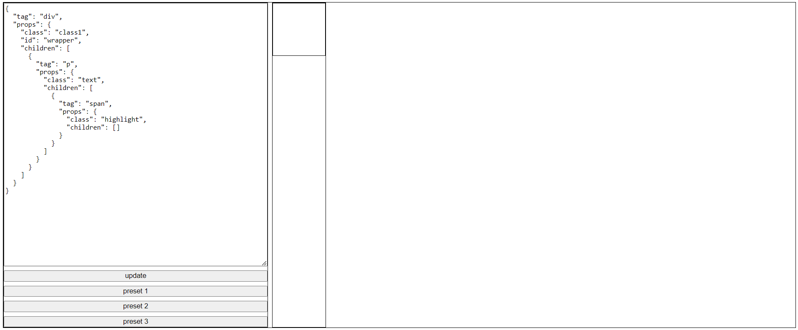

# Тестовое задание
1. написать мини js-framework, который может рендерить html из конфига
{
"tag": "div",
"props": {
"class": "class1",
"id": "wrapper",
"children": [....]
}
}
2. поддержать возможность динамического обновления html если конфиг меняется
3. написать на TS

## Установка и запуск проекта
1. npm install
2. npm run build
3. npm run example

Пример будет доступен по http://localhost:5000/example.html

В textarea слева можно ввести конфиг, после нажатия кнопки update в правой области отрисуется контент.
Для примера было добавлено 3 пресете с готовым конфигом

## Тестирование
1. npm run test
